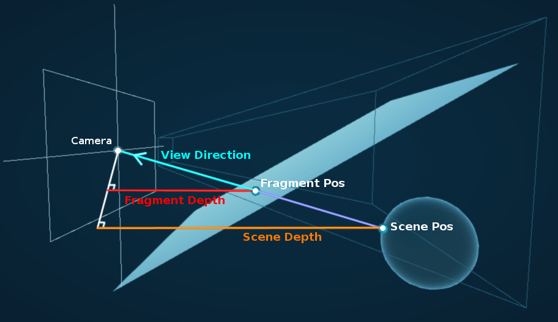
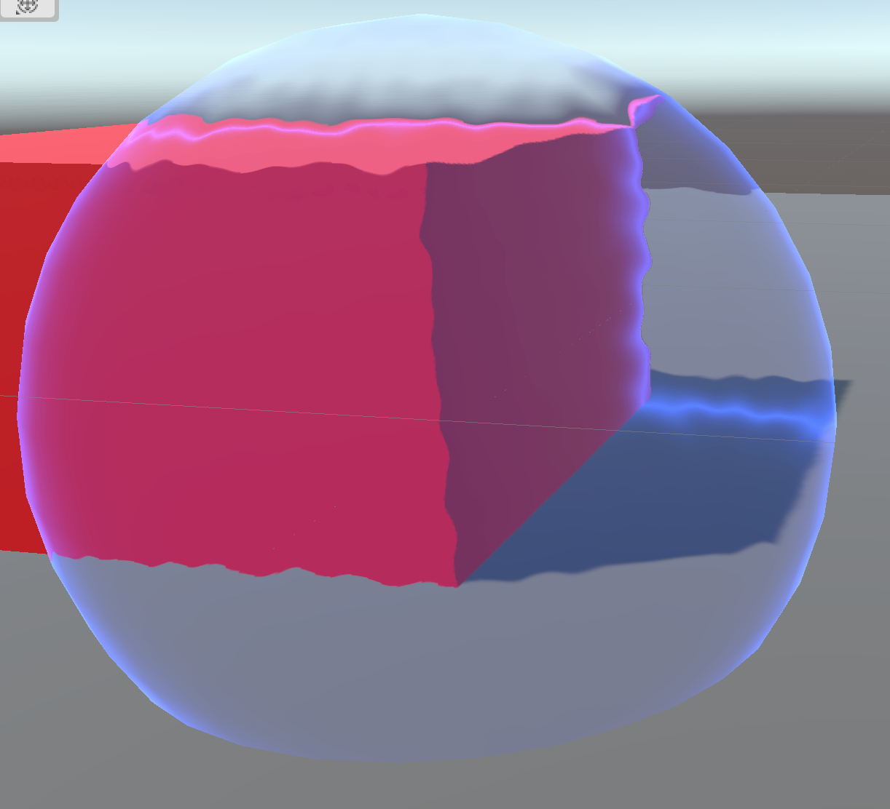
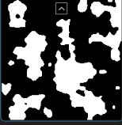
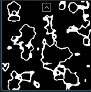

- [Water Shader Breakdown](https://www.cyanilux.com/tutorials/water-shader-breakdown/)
  id:: 62a57b95-7918-4845-9a9f-88f379691878
	- 通过对_CameraOpaqueTexture进行扭曲实现效果，需要URP设置勾选Opaque Texture
	- `Scene Color`节点可以采样这个纹理，输入的uv值归一化的屏幕坐标
	- 对归一化的屏幕坐标进行扰动，扰动值基于平面模型的uv，这样可以实现水波效果
	- uv值加上时间作为`Simple Noise`节点的输入产生扰动值，然后在和归一化屏幕坐标相加
	- 水面上方的不透明物体也会被扰动，需要判断从_CameraOpaqueTexture采样的屏幕像素在是否在水面上方
		- 比较片元和屏幕像素的线性深度值来判断
		- Eye模式下`Screen Depth`节点的输出是屏幕像素对应的线性深度值，需要渲染管线开启Depth Texture
		- Raw模式下`Screen Position`节点的输出的W分量是片元的线性深度值，Raw模式获得的是进行透视除法之前的值，W存储的就是线性深度值
		- 如果片元的深度值比屏幕像素的深度值大，则不需要扰动uv，否则用扰动后的uv作为`Scene Color`的输入
	- 焦散效果
		- 对`Voronoi`节点的做一系列处理后和扭曲的屏幕像素相加可以实现在水平的的焦散效果，然后再映射到水面下的物体，也就是用屏幕像素所在的世界空间位置的(X,Z)作为`Voronoi`节点的uv输入
		- 根据SceneDepth重建世界空间位置
		  id:: 62a57b95-14c1-462e-a988-bcb273aec5c8
			- 
			- 我们可以获取片元和屏幕像素的深度值以及片元相对于相机的位置，根据相似三角形原理可以计算屏幕像素相对于摄像机的位置，然后再去摄像机的世界空间位置就可以得到屏幕像素的世界空间位置
- [Jellyfish breakdown](https://www.cyanilux.com/tutorials/jellyfish-shader-breakdown/)
	- 在模型空间下，对顶点的xz值做缩放，缩放值由y轴做sin运算得出，这样可以得到物体y轴方向的波动效果
	- 远离触手根部，振幅越大
	- 顶点绕Y轴做sin波动旋转
	- 基于Y轴在两个颜色之间插值
- [Forcefield breakdown](https://www.cyanilux.com/tutorials/forcefield-shader-breakdown-simple/)
	- 设置为半透明模式，混合模式为alpha混合，双面渲染
	- 设置alpha的值为Fresnel的输出，实现从边缘到中心逐渐透明的效果
		- 背面的Fresnel值输出为1，需要判断片元是否是背面，如果是则设置为0
	- forcefield和场景中的不透明物体交接的效果
		- 深度缓冲区的深度值和片元深度值越接近，alpha值越大
		- 深度缓冲区读出的深度值减去片元深度值，然后clamp到[0,1],然后1减去得到的值
- [Forcefield Advanced](https://www.cyanilux.com/tutorials/forcefield-shader-breakdown/)
	- https://twitter.com/i/status/1162321274007367680
	- 
	- 半透明，但是Alpha值为1
	- 扭曲效果是通过`Scene Color`实现，也就是通过forcefield看不到半透明物体
	- fresnel效果让物体边缘高亮
	- 根据透过forcefield看到的像素所在世界空间坐标和片元世界坐标的距离得出二者相交的高亮部分
		- ((62a57b95-14c1-462e-a988-bcb273aec5c8))
		- 对距离做变换，使得相交部分的值为1，距离交点越远，值越小
	- 对`Scene Color`采样的颜色和固定颜色做lerp实现染色效果，然后把得到的颜色和之前得到的高亮部分相加，作为最终的颜色输出
	- 用`Gradient Noise`作为对uv的扰动，因为这样得到的波动比较平滑
		- 对屏幕空间的坐标按时间偏移，作为`Gradient Noise`的uv输入
	- 球面上的随机波纹
		- C\#生成波纹中心和存在时长数据，传给shader使用
- [Cloud Shader Breakdown](https://www.cyanilux.com/tutorials/cloud-shader-breakdown/)
  id:: 62c449bf-f021-4981-afb5-a0d319def3ea
	- 多重噪声对顶点偏移，用scene depth模拟云和物体接触的效果
	- 对世界坐标随时间做不同速率的变化，然后作为不同噪声的uv输入，把噪声的输出合成后作为对世界坐标的偏移，再把结果转换到模型空间，
	- 根据噪声在两个颜色之间插值
	- SmoothStep(CloudCover, 2*CloudCover + FallOff, Noise)作为alpha值来控制云的覆盖率
	- SceneDepth-FragDepth插值来控制云和物体接触处的浓度
- [Fog Plane Shader Breakdown](https://www.cyanilux.com/tutorials/fog-plane-shader-breakdown/)
	- 和 ((62c449bf-f021-4981-afb5-a0d319def3ea))实现原理差不多，不需要对顶点偏移
- [Toon glass shader breakdown](https://www.cyanilux.com/tutorials/toon-glass-shader-breakdown/)
	- 把世界空间下的坐标减去相机坐标后的坐标转换到切线空间，这样得到坐标的x分量是水平方向的，y分量垂直方向，这两个分量相加得到斜着的线
	- 对这个值进行幂运算，使得这个值变成非线性，然后再用frac得到一个非线性的值，再对这个值进行step，把这个值作为透明度，可以得到宽度不同的条纹
- [Dissolve Shader breakdown](https://www.cyanilux.com/tutorials/dissolve-shader-breakdown/)
	- 物体的全局溶解效果
		- 对噪声图做step处理，使得高于某个溶解层度值(_Amount)的噪声值变成1，低于的变成0，这个值作为透明度，然后做阈值为0.5的alpha clipping
		- 
	- 溶解边界的颜色
		- 对上面的噪声图用(_Amount+微小值)在做一次step处理，然后让两次的step结果相减就可以得到溶解区域的边缘，用这个值对物体的颜色和边缘色插值
		- 
	- 溶解进度从上往下
		- 模型空间的y轴取反后的值范围从上往下增加，以标准立方体为例，范围为[-0.5, 0.5],这个值和上面的噪声值(0~0.5)相加，也就是对一个线性值进行抖动，
	- uv接缝处过度不连续
		- 用模型的uv来采样噪声会出现不连续的问题
		- 可以用观察空间的xy作为采样坐标
		-